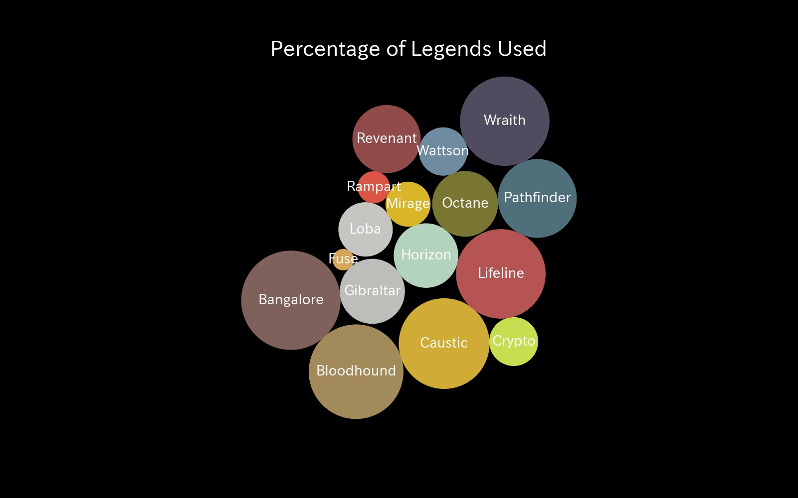

# ApexLegendsCharacterView

ApexLegendsのtracker APIを使用して自身の使用しているレジェンドの使用率をPacked-bubble chartで可視化するプログラムリポジトリ(S8現在)

## 可視化図



## Useage

1. [ブログ](https://murabitoleg.com/apexapi-python/)にてAPIの概観を掴んで，tracker.ggからAPIのキーを生成する．
2. Apexで各レジェンドにバナーにプレイ回数を載せる
3. 各レジェンドを選択した状態で5分程度放置するか1,2試合遊ぶ
4. `datacollect_view.py`を実行する

### プログラム変更部分

大きくは２つ，オプジョンとしてもう１つあります．

```
params = {"TRN-Api-Key":"XXX"} # You API key
endpoint = "profile/origin/shimasan0x00" # You Origin name . if PSN -> progile/psn/XXX

co = [
    '#7f605a',
    '#a28a5b',
    '#d0ab35',
    '#c7de51',
    '#d5a55c',
    '#bdbdb9',
    '#b4d3bd',
    '#b65454',
    '#c7c5c2',
    '#d9b628',
    '#797532',
    '#4f6f7b',
    '#db5445',
    '#904a49',
    '#6f8ba1',
    '#504b5f'
]
```

`params`部分は自身のAPIを書いてください．

`endpoint`は自身のプレイしている環境(steamは今の所ありません)とアカウント名を記入します．

オプションとしてレジェンドの円の色変更ができます．レジェンドはアルファベット順に並べているので該当部分を変更することで色が変わります．

詳しくはdfを見てみてください．